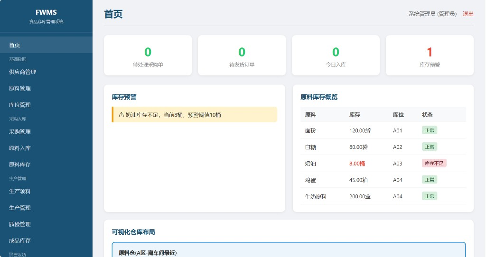

# FWMS - 食品加工企业智能仓库管理系统

Food Warehouse Management System (FWMS) — 基于 Java Spring Boot + MyBatis + MySQL 的软件工程实训项目。



## 团队成员（2301 计本）

| 姓名 | 分工 | GitHub 分支 |
|------|------|-------------|
| **吕聪睿** | 组长 / 后端 / 系统集成 | `dev-leader` |
| **李汶慧** | 前端 | `dev-frontend` |
| **毕梦婷** | 数据库 / 数据层 | `dev-database` |

## 项目仓库

GitHub 地址：https://github.com/CongruiLyu/FWMS

## 技术栈

| 层次 | 技术 |
|------|------|
| 后端框架 | Spring Boot 2.7 |
| 持久层 | MyBatis |
| 数据库 | MySQL 8.0 |
| 前端 | Thymeleaf + HTML/CSS/JavaScript |
| 连接池 | HikariCP（单例模式） |

## 系统功能

- **登录模块**：多角色权限（管理员、仓库管理员、采购员、质检员、生产人员、销售员）
- **供应商管理**：增删改查
- **原料管理**：原料信息维护
- **采购管理**：采购单创建、到货标记
- **原料入库**：验收 → 质检 → 合格入库 → 库存增加
- **原料库存**：库存查询、低库存红色预警
- **生产领料**：申请 → 仓库审核 → 发料 → 库存减少
- **生产管理**：生产批次记录
- **成品质检**：合格/不合格/返工
- **成品入库**：按交货期安排 C 区库位
- **客户订单**：销售订单管理
- **发货出库**：拣货 → 出库 → 库存减少
- **库位管理**：A原料/B车间/C成品/D发货 四区布局
- **首页功能**：库存预警 + 可视化仓库条形图

## 设计模式

| 模式 | 应用 |
|------|------|
| 单例模式 | HikariCP 数据库连接池 |
| 工厂模式 | `UserFactory` 按角色创建用户、权限判断 |
| 策略模式 | `AlertStrategy` 原料/成品不同预警策略 |
| 观察者模式 | `StockAlertSubject` 库存不足通知管理员 |

## 启动

### 1. 环境要求

- JDK 8
- Maven 3.6+
- MySQL 8.0+

### 2. 初始化数据库

```bash
mysql -u root -p < src/main/resources/sql/schema.sql
```

或在 MySQL 客户端中执行 `src/main/resources/sql/schema.sql`。

### 3. 修改数据库配置

编辑 `src/main/resources/application.yml`：

```yaml
spring:
  datasource:
    url: jdbc:mysql://localhost:3306/fwms?...
    username: root
    password: 你的密码
```

### 4. 编译运行

```bash
mvn clean package -DskipTests
java -jar target/fwms-1.0.0.jar
```

或直接：

```bash
mvn spring-boot:run
```

### 5. 访问系统

浏览器打开：**http://localhost:8080**

## 演示账号

| 用户名 | 密码 | 角色 |
|--------|------|------|
| admin | 123456 | 管理员（全部权限） |
| warehouse | 123456 | 仓库管理员 |
| purchaser | 123456 | 采购员 |
| qc | 123456 | 质检员 |
| production | 123456 | 生产人员 |
| sales | 123456 | 销售员 |

## 业务流程

```
供应商 → 采购订单 → 原料到货 → 质量检测 → 原料入库 → 库存增加
    → 生产领料 → 生产车间 → 产品生产 → 成品质检 → 成品入库
    → 客户订单 → 发货出库 → 库存减少
```

## 数据库表（17张）

`user`, `supplier`, `material`, `warehouse_location`, `material_stock`, `purchase_order`, `purchase_order_item`, `material_inbound`, `quality_inspection`, `material_outbound`, `product`, `production`, `product_stock`, `customer`, `sales_order`, `shipment`, `stock_alert`

## 项目结构

```
src/main/java/com/fwms/
├── FwmsApplication.java      # 启动类
├── config/                     # 配置
├── controller/                 # 控制器
├── service/                    # 业务逻辑
├── mapper/                     # MyBatis接口
├── entity/                     # 实体类
├── enums/                      # 枚举
├── pattern/                    # 设计模式
│   ├── factory/                # 工厂模式
│   ├── strategy/               # 策略模式
│   └── observer/               # 观察者模式
├── interceptor/                # 登录拦截
└── common/                     # 工具类

src/main/resources/
├── application.yml
├── mapper/*.xml                # MyBatis SQL
├── sql/schema.sql              # 数据库脚本
├── static/css, js              # 静态资源
└── templates/                  # 页面模板
```

## Git 协作流程

1. 各成员在对应分支开发：`dev-leader` / `dev-frontend` / `dev-database`
2. 完成后提交 Pull Request 合并至 `main`
3. 由组长（吕聪睿）Review 并 Merge
